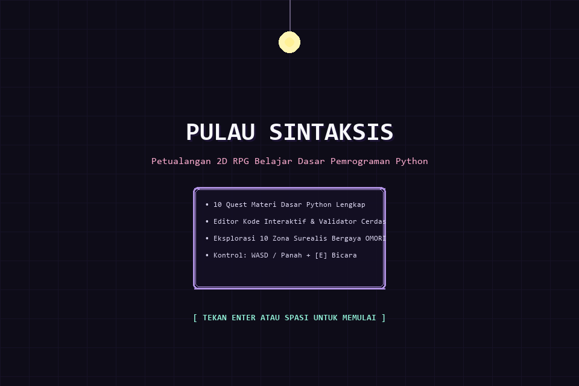
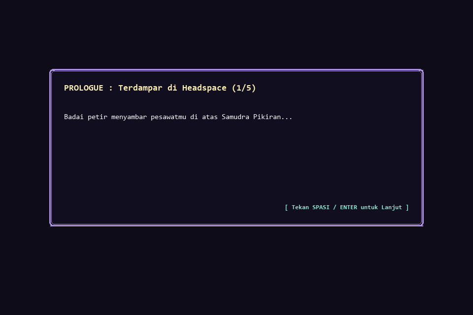
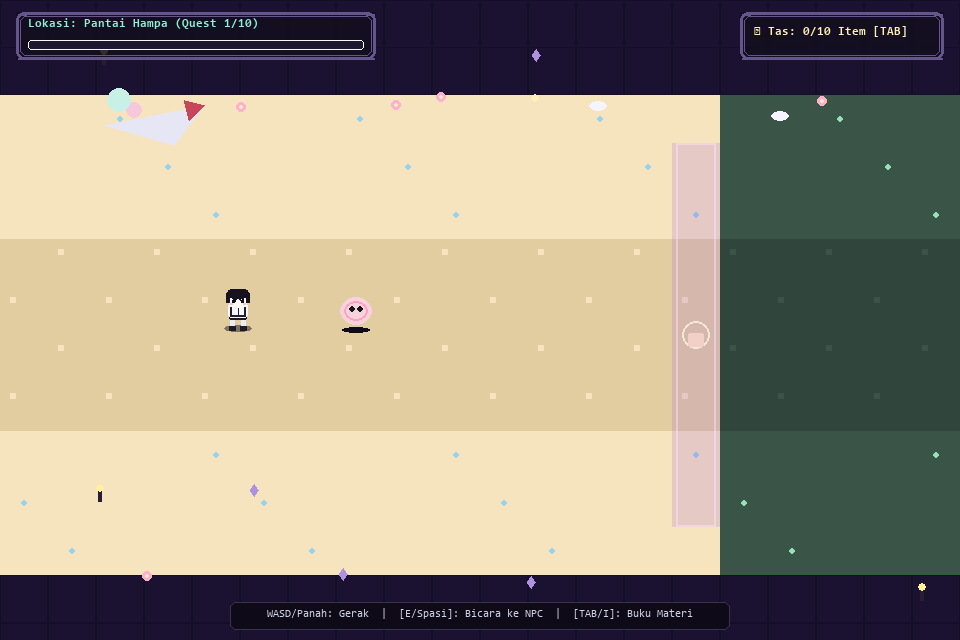
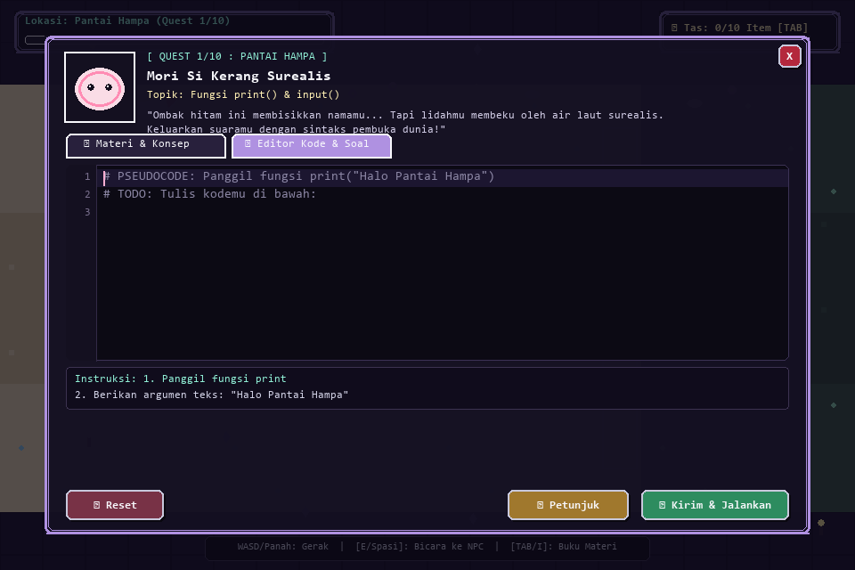
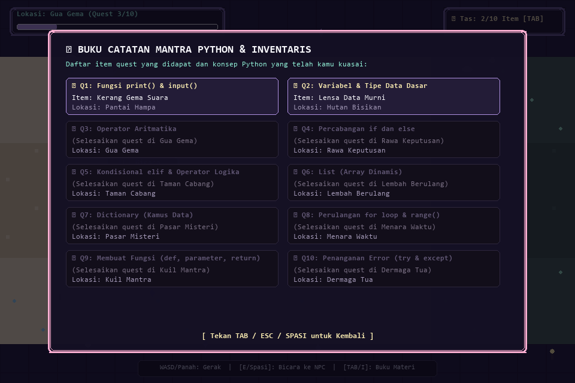
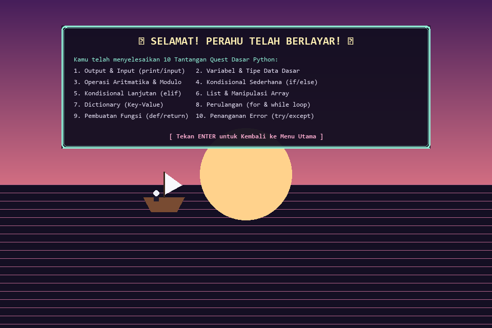

# 🌌 OMORI: Pulau Sintaksis (Python Learning 2D & 3D RPG)

Sebuah game 2D & 3D Graphical RPG interaktif untuk media pembelajaran dasar-dasar pemrograman Python, dengan atmosfer surealis, gaya visual pixel-art, dan palet warna pastel/monokrom yang terinspirasi dari dunia **Headspace** pada game **OMORI**.

Game ini tersedia dalam **2 Edisi**:
1. 🌐 **Edisi Web (HTML5 / JavaScript / Three.js 3D)**: Langsung dibuka di browser (Microsoft Edge, Google Chrome, dll) **tanpa perlu instalasi apapun**.
2. 🐍 **Edisi Desktop (Python / Pygame)**: Berjalan secara native melalui interpreter Python.

---

## 📸 Tangkapan Layar Gameplay (Gameplay Screenshots)

| 1. Layar Judul Utama (Title Screen) | 2. Layar Intro / Prologue Story |
| :---: | :---: |
|  |  |

| 3. Eksplorasi Dunia (Overworld Map) | 4. Modal Quest & Python Code Editor |
| :---: | :---: |
|  |  |

| 5. Tas Inventaris & Item Hadiah | 6. Layar Epilogue / Ending Perahu |
| :---: | :---: |
|  |  |

---

## 🚀 Cara Membuka & Memainkan di Browser (Microsoft Edge / Chrome)

Cukup **klik ganda (double-click)** file berikut di File Explorer Windows:
👉 `index.html`

*(Atau jalankan web server lokal dengan `python -m http.server 8080` dan buka `http://localhost:8080/`)*

---

## 🎮 Kontrol Permainan

| Tombol | Fungsi |
|---|---|
| **W / A / S / D** atau **Tombol Panah** | Menggerakkan karakter petualang |
| **E** atau **Spasi** | Mengajak bicara NPC / Membuka Quest |
| **TAB** atau **I** | Membuka Buku Catatan Materi & Tas Inventaris |
| **F5** atau **Klik Tombol UI** | Mengeksekusi / Mengirim Kode Jawaban Quest |
| **ESC** | Menutup menu / popup aktif |

---

## 📚 Kurikulum 10 Quest (Materi Python Dasar)

1. **Quest 1 (Pantai Hampa)**: `print()` dan `input()` — Berkenalan dengan *Mori Si Kerang* dan mengeluarkan sapaan pertama ke dunia.
2. **Quest 2 (Hutan Bisikan)**: Variabel & Tipe Data (`str`, `int`, `float`, `bool`) — Mendaftarkan data identitas jiwa kepada *Pohon Mata Bintang*.
3. **Quest 3 (Gua Gema)**: Operasi Aritmatika (`+`, `-`, `*`, `/`, `%`) — Menghitung pembagian kristal dan sisa bagi (modulo) bersama *Kelelawar Prisma*.
4. **Quest 4 (Rawa Keputusan)**: Percabangan Sederhana (`if` dan `else`) — Membuka jembatan teratai *Katak Mahkota*.
5. **Quest 5 (Taman Cabang)**: Percabangan Multi-Kondisi (`elif` dan logika `and`/`or`) — Menghidupkan kelopak warna-warni *Bunga Melankolis*.
6. **Quest 6 (Lembah Berulang)**: List / Array (`append()`, indexing) — Mengorganisir barang petualangan bersama *Kucing Pita Pastel*.
7. **Quest 7 (Pasar Misteri)**: Dictionary (Key-Value) — Menyusun catatan suku cadang perahu di lapak *Pedagang Topeng Bulan*.
8. **Quest 8 (Menara Waktu)**: Perulangan / Loops (`for loop` & `range()`) — Mengumpulkan serpihan detik bersama *Jam Bandul Bersayap*.
9. **Quest 9 (Kuil Mantra)**: Pembuatan Fungsi (`def` dan `return`) — Merumuskan formula pembangkit daya di altar *Patung Pendeta Cahaya*.
10. **Quest 10 (Dermaga Tua - Final)**: Penanganan Error (`try` dan `except`) — Mengamankan mesin perahu dari pembagian nol bersama *Kapten Boneka Beruang* dan berlayar pulang!

---

## 🎨 Fitur Web Engine & Audio
- **Zero-External Assets**: Seluruh sprite, tilemap 10 zona, dan partikel digambar langsung menggunakan HTML5 Canvas 2D & Three.js 3D.
- **Web Audio Synthesizer**: Suara typewriter bleeps, fanfare kemenangan, dan efek gerbang disintesis secara real-time via Web Audio API.
- **In-Browser Python Evaluator**: Mengevaluasi sintaks dan logika kode Python secara instan di dalam browser.

---

## 📂 Struktur File Proyek

```
game-phyton/
├── index.html            # Halaman utama game Web / WebGL
├── style.css             # Desain antarmuka, font retro, dan palet warna OMORI
├── audio.js              # Synthesizer efek audio retro via Web Audio API
├── quests.js             # Database 10 quest dan validator kode Python in-browser
├── game.js               # Engine game 2D Canvas & sistem dunia
├── game3d.js             # Engine game 3D WebGL (Three.js)
├── main.py               # Script utama Python Pygame edition
├── map.py                # Sistem Peta 2D & Objek Pygame
├── player.py             # Logika Karakter Pemain
├── quests.py             # Database Quest Pygame
├── ui.py                 # Antarmuka Pengguna Pygame
├── generate_previews.py  # Generator Otomatis Screenshots Gameplay
├── assets/
│   └── screenshots/      # Gambar-gambar gameplay untuk README
├── .gitignore            # Konfigurasi Git Ignore
└── README.md             # Dokumentasi Project
```

---

© 2026 OMORI: Pulau Sintaksis • Game Edukasi Pemrograman Python
